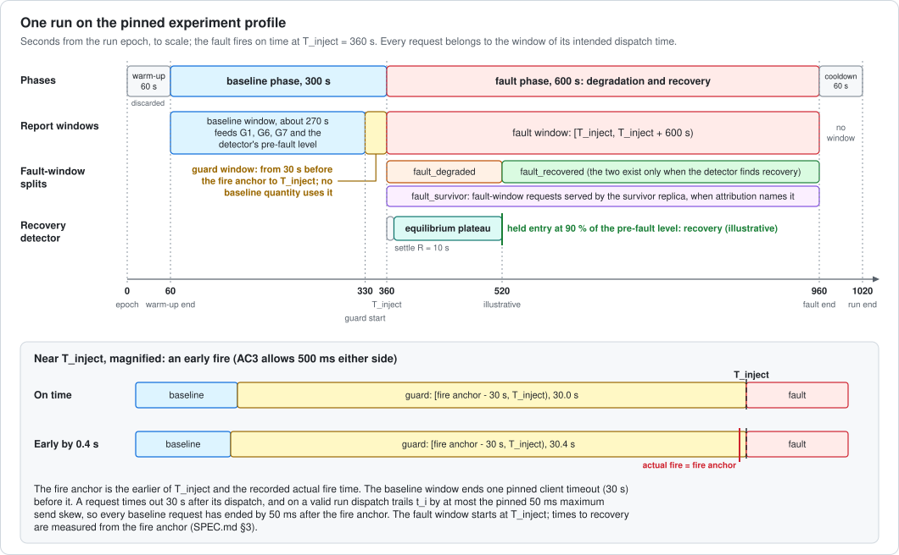
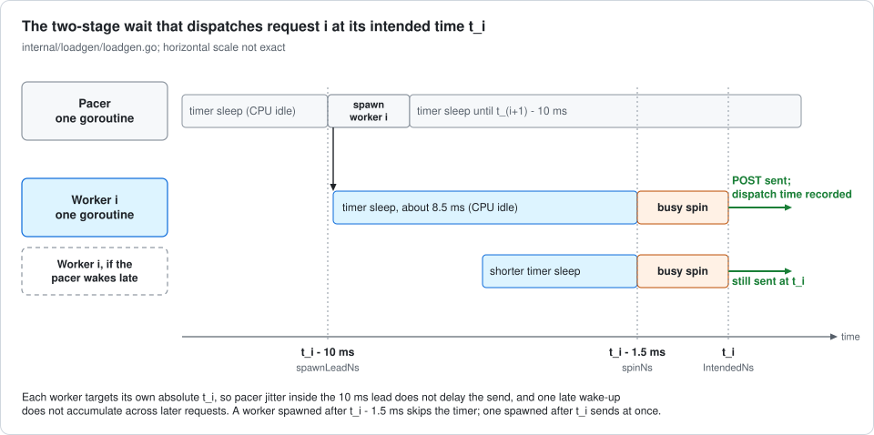
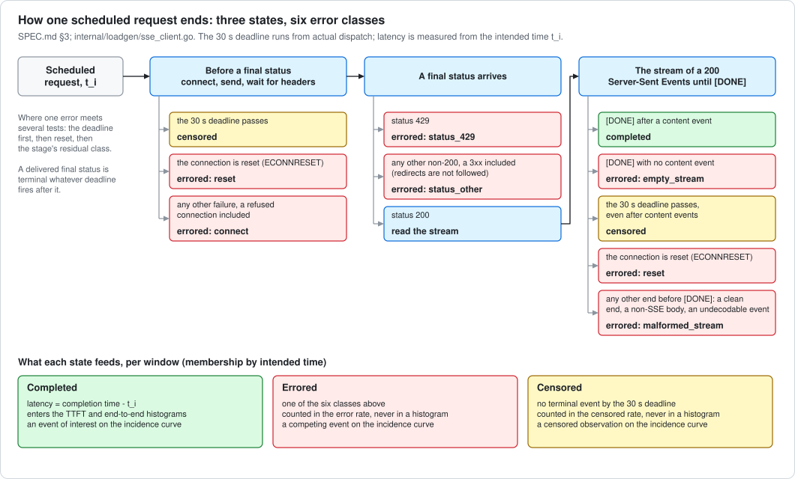
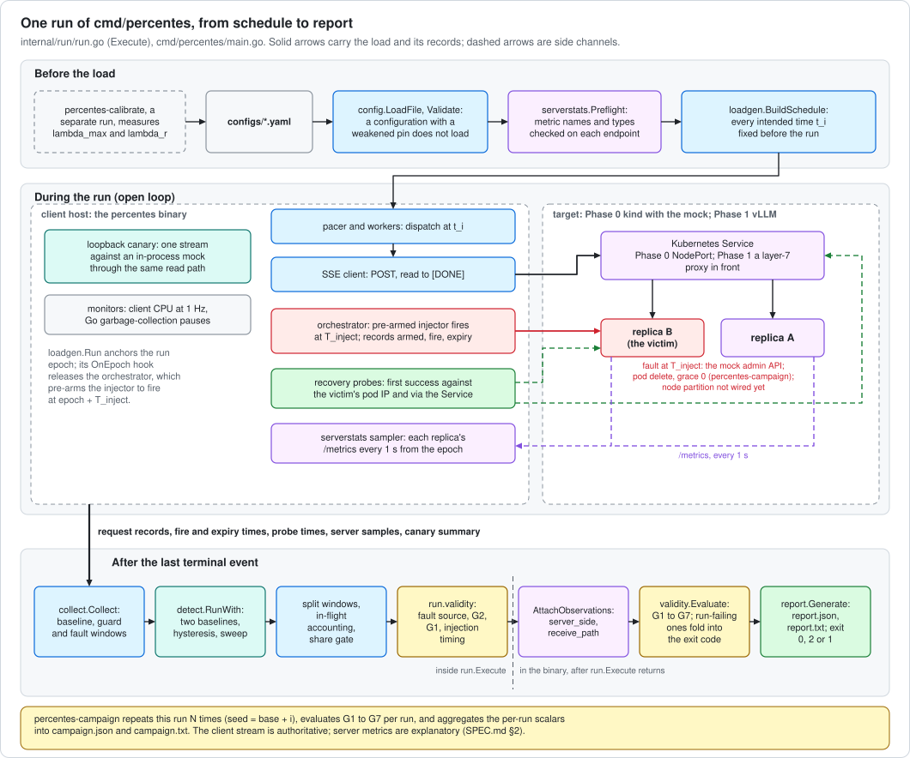
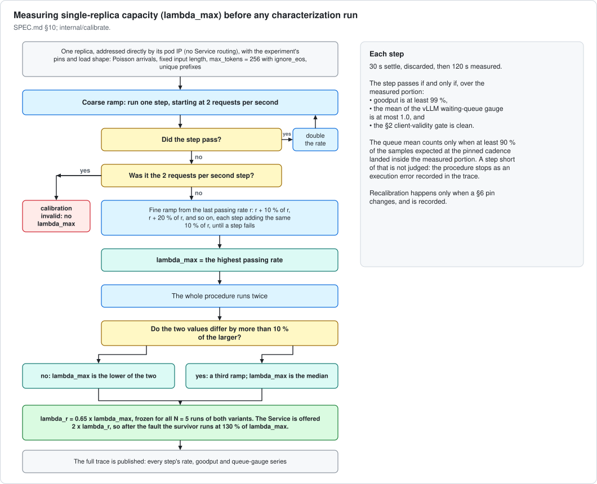
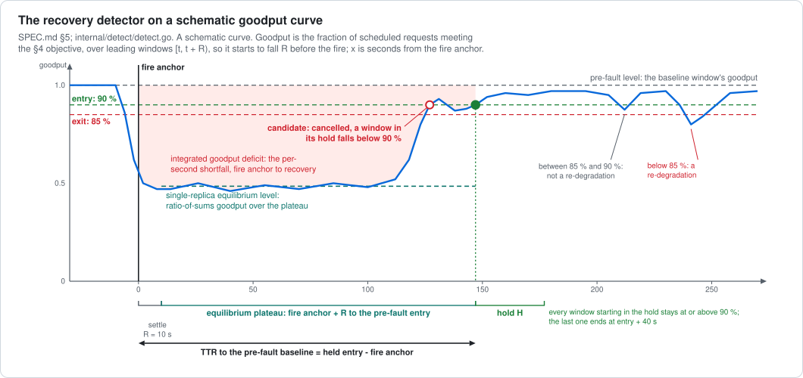
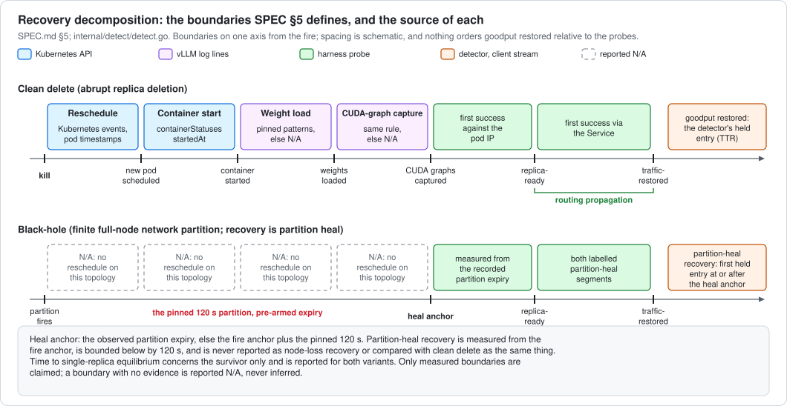
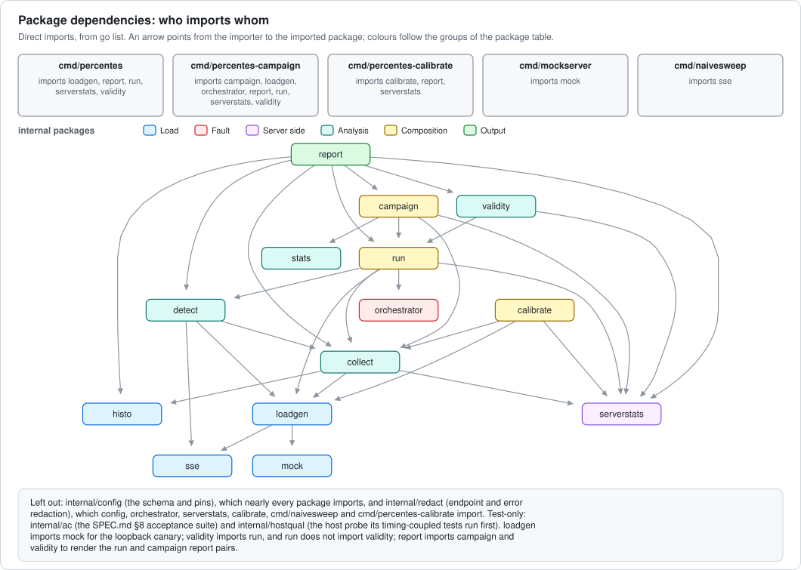

# Percentes architecture

Percentes is a measurement instrument. It drives open-loop load at a large
language model (LLM) inference service while one replica is
lost, and reports what the loss cost and how recovery unfolded. This page
describes how the code implements [SPEC.md](../SPEC.md), which is
authoritative. A § number always refers to a SPEC.md section.

- [Overview](#overview)
- [A run on the clock](#a-run-on-the-clock)
- [One request](#one-request)
- [Anatomy of a run](#anatomy-of-a-run)
- [Recovery detection](#recovery-detection)
- [Package map](#package-map)
- [Gates and where each bites](#gates-and-where-each-bites)
- [Server-side sampling and the receive path](#server-side-sampling-and-the-receive-path)
- [Fault modes](#fault-modes)
- [Tracing a published number](#tracing-a-published-number)
- [Changing things safely](#changing-things-safely)
- [Glossary](#glossary)

## Overview

### What is measured

§1 poses one question in three parts: when one replica of vLLM, the
open-source inference server the experiment targets, is lost under
sustained load, how many in-flight and queued requests fail or time out,
how the surviving replica degrades where there is one, and how long
recovery takes, split into measured segments.

Phase 0 builds the instrument and certifies it against a mock inference
server on a local kind (Kubernetes in Docker) cluster. Passing the
acceptance criteria (AC, §8) says nothing about behaviour on a real
graphics processing unit (GPU). Phase 1 runs the same harness against vLLM
on GPU nodes. One calibration has run against a standalone container.
The process-kill variant runs a new standalone container under the same
engine, model and GPU pins; its runs, and the two-replica Kubernetes
calibration and characterization runs, are pending.

§1 defines three fault variants. A clean delete removes the victim pod with
grace period 0. A black-hole fault partitions the victim's node for a
pinned 120 s and expires on its own; its recovery is partition heal, and a
run that passes the §1 runtime assertions carries the
node-loss-representative label. In Phase 0 the mock's fault modes stand in
for these two ([Fault modes](#fault-modes)). A process kill sends SIGKILL
(signal 9, which a process cannot catch) from the host to the vLLM
application programming interface (API) server process of one standalone
container, and the container runtime's restart policy starts the same
container again; with one replica there is no survivor and no Service.

The instrument can also drive a managed provider endpoint
(`target.hosted`). Hosted runs sit outside the §1 experiment; §6 lists what
changes for them, and [Gates](#gates-and-where-each-bites) shows the gates
they carry.

### Design rules the code enforces

- **Open loop.** Every request's intended dispatch time t_i is fixed before
  the run, and the generator never waits for a response before sending the
  next request. A generator that waited would send less while the service
  is slow and under-sample the slow period; that bias is called coordinated
  omission (§2). Latency is measured from t_i.
- **Three outcome states.** Every scheduled request ends completed,
  errored or censored (§3). Only completions enter the latency histograms,
  error and censored rates are reported per window, and the completion
  curve is the Aalen-Johansen cumulative incidence, the estimated share of
  scheduled requests completed by each time t after t_i. Errors are
  competing events on that curve, and only a request with no terminal
  event by the 30 s timeout is a censored observation.
- **Pinned numbers.** The configuration values SPEC pins are checked at
  load, and a configuration with a weakened value does not load
  (`internal/config`). The calibration rates lambda_max, the measured
  single-replica capacity, and lambda_r, the per-replica rate frozen at
  0.65 lambda_max, are recorded in the configuration's `calibration` block
  once §10 has run.
- **Missing measurements.** Of the §10 run-validity gates, G5 reports not
  applicable until its fingerprint capture is wired, and G7 when no metrics
  endpoints are configured. A recovery segment or an equilibrium estimate
  with no evidence is reported N/A (not applicable) with its reason.

### The binaries

| Binary | What it does | Output | Exit codes |
|---|---|---|---|
| `cmd/percentes` | one run | `report.json`, `report.txt` | 0 valid, 2 a gate invalidated the run, 1 error |
| `cmd/percentes-campaign` | N runs of one fault variant, gates per run, §7 aggregation; `--dry-kill` makes one process kill with no load | `run-N.json` and `run-N.txt` as each run ends; `campaign.json`, `campaign.txt`, partial after an error or a halt; under process kill `run-N-server.log`, `run-N-fingerprint-before.txt` and `run-N-fingerprint-after.txt`; `dry-kill.json` and `dry-kill-server.log` from `--dry-kill` | 0 every run valid, 2 at least one invalid run or a halted campaign, 1 error |
| `cmd/percentes-calibrate` | the §10 capacity calibration and the §5 single-replica reference; `--check` validates a configuration and lists its placeholders | `calibration.json`, `calibration.txt` | 0 valid, 2 calibration invalid, 1 error |
| `cmd/mockserver` | the mock inference server | | |
| `cmd/naivesweep` | a reconnaissance sweep of an OpenAI-compatible endpoint, outside the instrument: closed loop, no client-validity gates | | |

## A run on the clock

A run has four phases, whose ends `internal/loadgen/loadgen.go` sets from
the pinned durations: warm-up 60 s (discarded), baseline 300 s, the fault
phase, which is §1's degradation-and-recovery window with its 600 s
timeout, and cooldown 60 s. The load is identical throughout.

- **T_inject** is the configured fault instant, measured from the run
  epoch: the end of warm-up plus `fault.t_inject_offset_s`. The experiment
  profile sets the offset to 300 s, the end of the baseline phase, so
  T_inject is 360 s from the run epoch.
- **The fire anchor** is the earlier of T_inject and the recorded actual
  fire time (`collect.FireAnchorNs`). AC3 lets the fault fire up to 500 ms
  either side of T_inject. Times to recovery are measured from the fire
  anchor.

`run.Execute` builds the report windows. Every request belongs to the
window of its intended dispatch time, and each window is half-open,
[start, end).

| Window (report key) | Bounds | SPEC term |
|---|---|---|
| `baseline` | [warm-up end, fire anchor − 30 s) | baseline window (pre-fault) |
| `guard` | [fire anchor − 30 s, T_inject) | guard window |
| `fault` | [T_inject, end of the fault phase), which is T_inject + 600 s on the experiment profile | fault window |
| `fault_degraded` | [T_inject, recovery point), when the detector's recovery point falls inside the fault window | no separate term |
| `fault_recovered` | [recovery point, end of the fault phase), under the same condition | no separate term |
| `fault_survivor` | the fault window, restricted to requests served by the survivor replica, when baseline attribution names exactly one replica besides the victim | survivor cohort (§3) |

The recovery point is the pre-fault recovery, or partition-heal recovery
under the black-hole variant. No window covers the cooldown; the
detector's 1 s buckets still run to the end of the run. The guard window
exists because a request intended in the 30 s before the fire can still be
in flight when the fault fires, and counting it in the baseline would
charge a fault loss to the baseline.

The diagram's detector row is explained in [Recovery
detection](#recovery-detection).

## One request

`loadgen.BuildSchedule` fixes every t_i before the run. The pacer spawns a
worker 10 ms before t_i, and the worker dispatches at t_i. The
server-sent events (SSE) client (`internal/loadgen/sse_client.go`, with the
framing in `internal/sse`) posts to `/v1/chat/completions` and reads the
stream. The 30 s deadline runs from the actual dispatch.

### Pacer timing

If one loop did the precise wait and the dispatch itself, a hiccup while
handling request i (a garbage-collection pause, a scheduler delay) would
delay request i and push every later request back with it. The generator
splits the work in two (`internal/loadgen/loadgen.go`):

1. **The pacer**, a loop in one goroutine (Go's lightweight thread), sleeps
   until t_i − 10 ms (`spawnLeadNs`), spawns the worker for request i, and
   moves straight on to request i + 1. It never does the precise wait.
2. **The worker** sleeps on its own timer (`waitTimer`) until
   t_i − 1.5 ms (`spinNs`), then spins on the clock until it reaches t_i and
   dispatches. The timer keeps the spin short; the spin covers timer
   wake-up latency.

Each worker aims at its own absolute t_i, so pacer jitter inside the 10 ms
lead does not delay the send, and one late wake-up does not accumulate
across later requests. A worker spawned after t_i − 1.5 ms skips the timer,
and one spawned after t_i dispatches at once, its lateness recorded as send
skew, which the §2 client-validity gate bounds.

### From dispatch to outcome

The client stamps four moments:

- **dispatch:** send skew is dispatch time minus t_i;
- **the first content event:** time to first token (TTFT) is its time
  minus t_i;
- **each later content event:** the gap from the previous one;
- **the terminal event:** end-to-end (e2e) latency is the completion time
  minus t_i.

A content event is an SSE event whose decoded delta carries non-empty
content. Gaps between content events are inter-chunk latencies. On a
self-hosted or mock target the report calls them inter-token latency (ITL)
where the §10 check passes. A hosted target's gaps stay inter-chunk, and a
mock run without usage is labelled one token per content event by
construction ([token counts](#token-counts-and-the-itl-label)). A chunk carrying a usage object
supplies the completion token count.

The client classifies how each request ends into one of the three §3
states and, for an error, one of six classes, by the stage at which the
failure occurs. A stream is also classed `malformed_stream` when an event
or a line exceeds the 1 MiB bound the client reads with.

`collect.Collect` then, per window:

- assigns each request to the window of its intended time;
- records completed TTFT and e2e latencies into the pinned HdrHistogram
  (high-dynamic-range histogram) configuration through `RecordValue` only;
- adds every scheduled request to the window's incidence curve;
- counts error classes, error and censored rates, throughput, and goodput,
  the fraction of scheduled requests that complete within the §4
  service-level objective (SLO);
- runs the §4 threshold sweep and computes the content-event and
  usage-count distributions and the §7 tail confidence intervals (CIs).

`detect.BuildSeries` buckets the same records at 1 s for the detector.
Every latency, rate and detector figure is computed from these records.

## Anatomy of a run

The diagram follows one run of `cmd/percentes` from its setup to its report;
the sections below expand each part.

`run.Execute`, in code order:

1. `loadgen.Run` anchors the run epoch on the monotonic clock and fires the
   `OnEpoch` hook before it starts the pacer.
2. The hook releases the orchestrator, which pre-arms the injector to fire
   at epoch + T_inject with automatic expiry and records the armed, fire and
   expiry times. §1 requires pre-arming because a black-hole partition
   makes the victim unreachable the moment it fires. Each §5 recovery probe
   runs when `cmd/percentes` is given its uniform resource locator (URL):
   `--probe-direct` for replica-ready, `--probe-service` for
   traffic-restored. A probe starts at the planned fire and polls every
   500 ms until its first counted success or the end of the fault phase; a
   success counts only after the fault was visible on that path.
   `percentes-campaign` takes `--probe-direct`, required under the
   process-kill variant, and passes it to every run; it passes no service
   probe URL, so traffic-restored and routing propagation are N/A in its
   runs.
3. The load runs open loop through warm-up, baseline, the fault phase and
   cooldown. Monitors sample client central processing unit (CPU) use at
   1 Hz and the Go garbage-collection (GC) pause histogram for the §2 gate.
4. After the last terminal event:
   1. the phase windows are collected (baseline, guard, fault);
   2. the detector runs (`detect.RunWith`): two baselines, hysteresis, the
      27-row sensitivity sweep, integrated deficits, per-component recovery;
   3. the split windows are collected: `fault_survivor`, and
      `fault_degraded` and `fault_recovered` at the recovery point;
   4. in-flight-at-fire requests are classified by outcome and replica
      (`collect.AccountInFlight`), the share gate is computed from
      per-request replica attribution (`run.shareGate`), and the §4
      threshold analysis runs;
   5. the probe times fill the decomposition, and for a mock fault the
      scheduled fires are read back from `/admin/faults`;
   6. `run.validity` decides validity from the fault source, the
      client-validity gate (G2), the share gate (G1) and the injection
      timing.
5. `run.Execute` returns. The binary attaches the server samples and the
   canary streams (`AttachObservations` fills the top-level `server_side`
   and `receive_path` maps, keyed by window), evaluates G1 to G7
   (`validity.Evaluate`), renders the report pair (`report.Generate`), and
   exits 0, 2 or 1.

**Campaigns.** `percentes-campaign` runs N repetitions of one variant with
seed base + i. For a clean delete it resolves each run's victim and arms a
fresh injector that deletes the pod through kubectl on a named context:
with `--victim` it waits for that pod to be Ready, and with
`--victim-selector` for every replica to be Ready before it picks one. It
evaluates G1 to G7 per run and aggregates the per-run scalars under §7
(`campaign.Run`, `stats.Summarize`): all values, median, mean and a
t-interval whose degrees of freedom follow the contributing runs, with
heavy-tailed scalars led by the median and range. Each endpoint reports
how many runs were dropped and why. The black-hole variant is refused until
the node-partition injector is wired. The process-kill runner is described
under [Fault modes](#fault-modes).

**Calibration.** `percentes-calibrate` runs the §10 procedure against one
replica addressed directly: coarse and fine ramps, the two-ramp agreement
rule, lambda_r frozen at 0.65 lambda_max, and the §5 reference run at
2 × lambda_r. Every step is a §3 collection over its measured window, with
the queue-gauge series, the kept families' reductions and the §2
receive-path report; the trace is rewritten after every step. The binary
writes `calibration.json` and `calibration.txt`, and the values are then
entered in the configuration's `calibration` block.

## Recovery detection

The detector (`internal/detect`) works on goodput over R = 10 s windows of
1 s buckets, keyed by intended dispatch time. The window at time t covers
[t, t + R), a leading window, so an entry time is the start of the good
service it describes, and the curve starts to fall R before the fire.

- **Entry and hold.** A candidate entry is a window at or above 90 % of the
  applicable baseline. It becomes recovery only if every window starting in
  the following H = 30 s also stays at or above 90 %; any window below 90 %
  cancels it (`canceled_entries`). The time to recovery (TTR) is the held
  entry's start minus the fire anchor.
- **Exit.** After recovery, a window below 85 % starts a re-degradation
  episode, which ends when a window is back at 90 % (`re_degradations`);
  the TTR stands.
- **Two baselines.** The pre-fault level is the baseline window's goodput
  from the collector. The single-replica equilibrium level is the
  ratio-of-sums goodput over the plateau, from fire anchor + R to the
  earlier of the pre-fault entry or the 600 s timeout, estimable only when
  that span is at least R and its goodput is above zero. Each baseline has
  its own TTR.
- **Unobserved.** A candidate whose hold runs past the end of the series is
  reported unobserved (`hold_unobserved`), which differs from not
  recovered, where no held entry starts before the timeout. A cut entry
  window counts as unobserved only when its missing seconds, each at the
  observed mean load and all of it good, could still lift it to 90 %.
- **Partition heal.** Under the black-hole variant the labelled recovery is
  the first held entry at or after the heal anchor: the observed partition
  expiry, else fire anchor + 120 s. The raw threshold crossing is reported
  beside it.
- **Sweep and deficit.** The sensitivity sweep runs entry 85, 90 and 95 %,
  R 5, 10 and 20 s, and H 15, 30 and 60 s, with exit fixed at 85 %: 27 rows.
  The integrated goodput deficit sums each second's shortfall below the
  baseline level, from the fire anchor to recovery, or to the timeout when
  there is none.
- **Components.** `ttft_slo`, `e2e_slo` and `error_rate` each get their own
  detection against their own pre-fault level. Backlog drain is reported
  unmeasured in every run; no code path measures it yet.

The decomposition (`detect.NewDecomposition`, filled in
`run.Execute`) reports each §5 boundary with its source. The probes supply
replica-ready and traffic-restored when they run, and the detector
supplies goodput restored. When `--victim` names the victim replica, the
traffic-restored probe counts only a success whose `X-Percentes-Replica`
header names that replica, a header only the mock sends; without
`--victim` it counts any success. Routing propagation is traffic-restored
minus replica-ready. No code path measures the Kubernetes API and log
boundaries yet (reschedule, container start, weight load, and the graph
capture of CUDA, NVIDIA's Compute Unified Device Architecture), so the
clean-delete and black-hole variants report them N/A. Under the
process-kill variant, container start comes from the container's
`StartedAt` in `docker inspect`, the vLLM startup boundaries and the
figures vLLM prints come from the server log (`internal/vllmlog`, patterns
pinned to vLLM 0.29.0), and reschedule, traffic-restored and routing
propagation are N/A. The code measures the probe segments from the fire in every variant; §5
measures the black-hole ones from the partition expiry, which lands with
the node-partition injector.

The figure shows the §5 boundaries of the two Kubernetes variants. Of
those, the code measures the probe and detector ones.

## Package map

| Group | Package | Role | SPEC | Entry points | Tests |
|---|---|---|---|---|---|
| Configuration | `internal/config` | schema in YAML (YAML Ain't Markup Language), strict decode, pins checked at load | §1 to §6, §8, §10 | `LoadFile`, `Config.Validate`, `CheckBaseURL` | a mutation case per pin |
| Load | `internal/loadgen` | schedule, pacer, SSE client, outcome classification, client gate, loopback canary | §2, §3 | `BuildSchedule`, `Run`, `StartCanary`, `SummarizeCanary` | request-body, stream-hardening and gate units; canary oracle; AC1 to AC2d |
| | `internal/sse` | SSE framing for the client, the recovery probes and naivesweep | §3 | `SplitLines`, `Events` | a unit per grammar case |
| | `internal/histo` | the pinned HdrHistogram wrapper; `RecordValue` only, and a test fails the suite if a correction API appears | §3 | `New`, `H.Record`, `H.Summarize` | the correction-API ban; AC1 oracles |
| | `internal/mock`, `cmd/mockserver` | OpenAI-compatible SSE mock: five scriptable fault modes and a slow-reload startup setting | §2 | `New`, `Server.Start`, `/admin/faults` | a behaviour test per mode, including a raw Transmission Control Protocol (TCP) silent-hang test |
| Fault | `internal/orchestrator` | pre-armed fault execution with armed, fire and expiry records; mock-admin, clean-delete and process-kill injectors; container commands over SSH (Secure Shell) | §1, §2, AC3 | `Execute`, `NewMockInjector`, `NewCleanDeleteInjector`, `NewProcessKillInjector`, `SSHContainerOps` | AC3; fake-ops tests; a fake `ssh` on PATH |
| Server side | `internal/serverstats` | Prometheus sampler, per-window reductions, G7 baseline means | §2, §6, §10 | `ForRun`, `Sampler.Start`, `Sampler.Stop`, `Preflight`, `BaselineMeans`, `ReduceWindow` | test servers; window, reset and per-label-set oracles |
| Analysis | `internal/collect` | windows, incidence curves, in-flight accounting, threshold analysis, tail CIs, receive-path report | §3, §4, §7 | `Collect`, `EstimateIncidence`, `AccountInFlight`, `SplitAtFire`, `AnalyzeThresholds` | hand-computed incidence oracles; AC4, AC4b |
| | `internal/detect` | recovery detector, decomposition, recovery probes, /health calibration | §5 | `BuildSeries`, `RunWith`, `ProbeRecovery`, `CalibrateHealth`, `NewDecomposition` | synthetic-series units; AC5 |
| | `internal/vllmlog` | vLLM startup-log boundaries and printed figures, patterns pinned to vLLM 0.29.0, applied to the process-kill decomposition | §5 | `Parse`, `Apply`, `VLLM0290`, `Mock` | the 16 September 2026 vLLM start log as a byte-exact fixture |
| | `internal/validity` | the G1 to G7 run-validity gates | §10 | `Evaluate` | a unit per gate |
| | `internal/stats` | §7 statistics: values, median, mean, t-interval, coefficient of variation | §7 | `Summarize` | hand-computed oracles |
| Composition | `internal/run` | one run's artifacts | §2 | `Execute` | the whole pipeline in process under the race detector |
| | `internal/campaign` | N runs, per-run scalars, endpoint summaries with drop counts, halt after an invalid run | §5, §7, §10 | `Run`, `RunWith` | fake-runner units |
| | `internal/calibrate` | the §10 ramps and the §5 reference | §10, §5 | `RunRamp`, `Calibrate`, `Reference`, `LoadRunner` | a capacity-model fake runner; one step against the mock |
| Output | `internal/report` | the report pairs for a run and a campaign | §2 to §5, §7 | `Generate`, `GenerateCampaign` | renderer units; AC6 field assertions |
| | `internal/redact` | endpoint and error redaction for every published artifact and error string | §6 | `URL`, `ErrorText`, `Wrap` | leak tests across the packages that print |
| Test support | `internal/hostqual` | the host qualification probe the timing-coupled tests run first | §2, §8 | `Measure`, `Observation.Qualify`, `Qualified`, `Allocation` | per-limit units |
| | `internal/ac` | the §8 acceptance suite; the mock runs as a separate process, so it never shares the generator's Go scheduler | §8 | | |

`detect.Run` wraps `RunWith` for a bare bucket series; the acceptance
suite calls it. `internal/stats` also implements the Holm step-down
correction for multiple comparisons, with tests; no campaign path calls it
yet.

| Path | Contents |
|---|---|
| `deploy/kind/` | the cluster configuration (one node, image pinned by digest, host port 18000 mapped to NodePort 30800); `smoke.sh`; `reproduce.sh`, the AC7 one-command run; `campaign-e2e.sh` |
| `deploy/mock/` | the two-replica mock Deployment and its NodePort Service; a readiness probe on `/health` and no liveness probe, so silent_hang can hold `/health` silent |
| `deploy/process-kill-e2e.sh` | the process-kill end-to-end: the mock in a Docker container under `--restart on-failure`, one dry kill and a two-run campaign that kill and restart it, and a check of the dry-kill record and the run files |
| `deploy/phase1/` | the vLLM topology manifest, which does not deploy until its PIN-AT-PHASE1 placeholders are filled; capture scripts for the host fingerprint, the GPU sample series and the server log |
| `configs/` | every runnable configuration; one file drives both the cluster ConfigMap and the host runner |

## Gates and where each bites

| Check | Pinned numbers | When | Consequence | Enforced in |
|---|---|---|---|---|
| Configuration pins | SPEC numbers from §1 to §5, §8 and §10 as equalities or bounds; §6 environment values as required fields | configuration load | the configuration does not load | `config.Validate` |
| Metric preflight | the queue gauge, every kept family and the TTFT histogram's type, read on each endpoint | before the load | the binary exits before any dispatch | `serverstats.Preflight` |
| G2: send skew | 99th percentile (p99) ≤ 5 ms and max ≤ 50 ms, compared in nanoseconds | judged after the run | run invalid | `loadgen.evaluateGates`, `run.validity` |
| G2: undispatched | zero scheduled requests never dispatched | judged after the run | run invalid | same |
| G2: client CPU | ≤ 70 % over any 5 s window | judged after the run | run invalid; unmeasured counts as failed | same |
| G2: GC pause | p99 < 1 ms, on the upper edge of the runtime histogram bucket that holds it | judged after the run | run invalid; a p99 in the runtime's open last bucket fails | same |
| Fault source | an armed injector, or the mock's scheduled fires read back | after the run | run invalid | `run.validity` |
| Injection timing (AC3) | fire within 500 ms of T_inject | after the run | run invalid | `run.validity` |
| G1: share (§1) | 45 to 55 % per replica over the baseline window | after the run | run invalid under a per-request (layer-7) dataplane, descriptive under per-connection routing; a replica count other than the declared one, or no attributed baseline request, fails in either regime; not applicable to a one-replica target | `run.shareGate`, `config.BalancesPerRequest` |
| G3, G4 (black-hole only) | zero errored victim in-flight requests; staleness window ≥ 20 s with victim-bound traffic | per-run evaluation | a failed or unobserved gate strips the node-loss-representative label, and the run stays valid | `validity.Evaluate` |
| G5 | GPU clock and power fingerprints equal across replicas and runs | per-run evaluation | not applicable until the capture output is wired | `validity.Evaluate` |
| G6 | baseline goodput ≥ 0.99 | per-run evaluation | run invalid | `validity.Evaluate` |
| G7 | per-replica waiting-queue mean ≤ 1.0 over the baseline window, with ≥ 90 % of the expected samples | per-run evaluation | run invalid; not applicable without `target.metrics_urls` | `validity.Evaluate` |

`percentes` and `percentes-campaign` fold run-invalidating gate failures
into exit code 2; `run.Execute` has already recorded G1 and G2. An
applicable gate that goes unobserved fails. `make bins`, `reproduce.sh` and
`campaign-e2e.sh` build with `CGO_ENABLED=0` (cgo, Go's C interoperability,
disabled), and on macOS that leaves the client CPU gate unmeasured, so such
a run exits 2; Linux measures CPU from `/proc`. The fault-source and
injection-timing checks sit outside SPEC's G1 to G7 list and invalidate a
run in the code.

**Hosted targets.** Only G2 and G6 are evaluated. Hosted G6 is completion
within the 30 s timeout, computed over the baseline, guard and fault
windows and reported without invalidating the run; §10 defines G6 over the
baseline window. The request body omits `ignore_eos` and asks for no usage
object, and the bearer token comes from the environment variable that
`target.api_key_env` names.

**Timing-coupled tests.** Before each timing-coupled acceptance test,
`internal/hostqual` probes the host against limits set in
`hostqual.Allocation` from the §2 budget: timer wake lateness p99 ≤ 1 ms,
plus 1 ms on Linux, where Go's poller waits in whole milliseconds, and
max ≤ 10 ms, and a GC pause p99 bucket edge of at most 1 ms. A test
skips only on a host that fails the probe, and re-probes after a failed
timing assertion before it fails. `make test-ac` fails on any skip unless
`PERCENTES_AC_ALLOW_SKIPS=1`.

## Server-side sampling and the receive path

### The sampler

`target.metrics_urls` names one Prometheus endpoint per replica (keyed r0,
r1 in order), each sampled every 1 s from the run epoch.
`target.queue_gauge` (`vllm:num_requests_waiting` on vLLM,
`percentes_mock_requests_waiting` on the mock) feeds G7: the per-replica
mean over the baseline window, with coverage of at least 90 % of the
expected samples. The kind campaign sets no `metrics_urls`, since each
pod's endpoint needs its own address behind the one NodePort Service.

`target.metrics_families` names the families kept on every sample. The
top-level `server_side` map reduces them per window and replica:

| Family type | Per-window value |
|---|---|
| gauge, untyped | the mean over the samples inside the window |
| counter | the increase, measured per label set from its last sample before the window (or its first inside) to its last inside, summed over label sets |
| histogram | the increase in count, sum and buckets by the same rule, the +Inf bucket left out |

A label set missing from a sample adds nothing there, and one first seen
inside the window adds its whole value. A label set that falls, or a
histogram whose bucket layout changes, is marked as a reset and
contributes its later value; after a layout change no buckets are
reported. A non-finite value, or a sum over label sets that overflows, is
an error counted in `family_errors`. The run report keeps the sample series
under `server_samples`.

### The receive-path checks

The two §2 checks are reported per window in the top-level `receive_path`
map, and neither fails a run:

- the client-side TTFT mean over completed requests, against the mean of
  the server's TTFT histogram (`target.ttft_histogram`) over the same
  window, pooled across replicas; the difference also holds the network
  round trip and any difference in where the server starts its clock;
- the loopback canary, one stream against an in-process mock with fixed
  timing through the same read path: its event lag p99 and max bound the
  host's read-loop lag, with the first-token and per-gap deviations beside
  them.

A window restricted to one replica carries no receive-path report.
`percentes-calibrate` takes the same settings as `--families` and
`--ttft-histogram`.

### Token counts and the ITL label

A self-hosted or mock request asks for the usage object
(`stream_options.include_usage`); the hosted body does not. The client
records the completion token count from any chunk that carries usage,
beside its own content-event count. Each window reports both counts as
distributions (`content_events`, `completion_tokens`) and the §10 check
over the completed requests that carried usage (`token_check`: sampled and
matched).

| Case | Pooled ITL label in `report.txt` |
|---|---|
| hosted target | inter-chunk, with the counts when a provider sent usage unasked |
| usage sampled, every request matched | inter-token, with the counts |
| usage sampled, a mismatch | inter-chunk, with the counts |
| mock, no usage in the stream | one token per content event by construction |
| any other target with no usage | inter-chunk |

## Fault modes

The mock's modes stand in for the §1 variants in Phase 0: `stream_abort`
reproduces the resets of a clean delete, and `silent_hang` the silent drops
of a black-hole partition.

| SPEC §2 name | Configuration | Mock behaviour | What the instrument must show |
|---|---|---|---|
| stall | `stall` | server-wide emission freeze, staggered flush on expiry | completions delayed; the excess lands in p99.9 and max (AC2); lambda × D samples attributable to a stall of length D (AC2b) |
| error | `error` | 5xx on new requests; in-flight streams untouched | an error-rate step in the fault window; the goodput dip yields a detector TTR |
| throttle | `throttle` | 429 on new requests; in-flight streams untouched | `status_429` in the fault window's error classes, absent from the baseline |
| stream-abort | `stream_abort` | a TCP reset (RST) of in-flight streams at fire, sent by closing with `SO_LINGER=0`; admitted streams reset after N tokens | in-flight requests classified errored as `reset`, absent from the histograms (AC4) |
| silent-hang | `silent_hang` | no bytes, no clean close (FIN) and no RST, ever, on hijacked connections; captured requests stay hung past expiry | censored at exactly 30 s and entered on the incidence curve as censored observations (AC4b) |
| slow-reload-on-reschedule | `mock.slow_reload`, a startup setting | 503 for a set duration after process start | the replica-ready probe boundary in the decomposition |

The first five are scheduled in the configuration or armed through the
mock's `/admin/faults`; slow reload is set when the mock starts.

**Process kill.** The process-kill variant runs against a container on a
Docker host: vLLM in Phase 1, the mock in its end-to-end test. Before each
run `percentes-campaign` waits until the container is running, `/health`
returns 200 and one streamed inference succeeds, then reads the
container's process ID (PID), start time and restart count from
`docker inspect` and measures the host clock's offset from the client
clock. `orchestrator.ProcessKillInjector` sends SIGKILL to that PID at
T_inject after checking that the PID still belongs to the container; the
kill script stamps the host clock before and after the kill, and the
recorded fire is the midpoint of that bracket converted by the offset.
Docker's `on-failure` restart policy starts the same container again.
After the run the campaign reads the restart count, which must have
advanced by exactly one and must not have moved between runs, the
container's `die` and `start` events, the server log, from which
`internal/vllmlog` fills the decomposition's log rows, and the
fingerprints. A restart policy or container name other than the §6 pins
invalidates the run. `collect.SplitAtFire` separates the in-flight
requests ending just after the fire, which are indeterminate, from the
rest, and the requests scheduled from the fire to replica-ready are
collected as the `outage` window. The commands run over SSH on the host
`--ssh-target` names, or locally when it is empty. `deploy/process-kill-e2e.sh`
(`make process-kill-e2e`, in `make test` and in the `kind` job of
continuous integration) runs the mock in a Docker container under the
same restart policy, kills it once with `--dry-kill` and again in two
campaign runs, and checks the dry-kill record and the run files; on macOS it reaches the container's process through a privileged
helper container (`--kill-via docker-helper`).

## Tracing a published number

`report.json`, the JavaScript Object Notation (JSON) report of one run:

| Field | Computed in | SPEC |
|---|---|---|
| `windows.*.ttft_conditional_on_completion`, `e2e_conditional_on_completion` | `collect.Collect`, `histo.H.Summarize` | §3 |
| `windows.*.error_rate`, `censored_rate`, `err_classes` | `collect.Collect` | §3 |
| `windows.*.completion_incidence` (points, censored count, final survival, horizon) | `collect.EstimateIncidence` | §3 |
| incidence quantiles and their refusals, in `report.txt` only | `report.incidenceText` through `IncidenceCurve.Quantile` and `Ceiling` | §3 |
| `windows.*.itl_pooled` | `collect.Collect` | §3 |
| `windows.*.content_events`, `completion_tokens`, `token_check` | `collect.Collect` | §6, §10 |
| `windows.*.goodput_frac`, `goodput_rps`, `goodput_sweep` | `collect.Collect` | §3, §4 |
| `windows.*.ttft_tail_ci`, `e2e_tail_ci` | `collect.tailCIs`: 95 % order-statistic intervals, ranks by the normal approximation to the binomial, refused where a rank falls outside the sample | §7 |
| `windows.fault_survivor` | `collect.Collect` over the replica `run.survivorOf` names | §3 |
| `windows.outage` (process kill) | `collect.Collect` from the fire to replica-ready, in `percentes-campaign` | §1 |
| `threshold_analysis` | `collect.AnalyzeThresholds` | §4 |
| `in_flight_at_fire`, with `on_victim_*` | `collect.AccountInFlight` against the recorded fire; under process kill, `determinate` and `indeterminate_at_fire` from `collect.SplitAtFire` | §1, §3 |
| `detector.to_pre_fault`, `to_equilibrium`, `sensitivity`, `components` | `detect.RunWith`, one `detect.detect` per detection | §5 |
| `detector.equilibrium_*`, `backlog_drain_*` | `detect.RunWith` | §5 |
| `detector.partition_heal_recovery`, `heal_anchor_ns`, `integrated_goodput_deficit_to_partition_heal` | `detect.RunWith`, black-hole variant only | §5 |
| `decomposition.segments` | `detect.NewDecomposition`, probe times in `run.Execute`; under process kill, container and log times from `percentes-campaign` through `vllmlog.Apply` | §5 |
| `container` (process kill) | `percentes-campaign`: container state before and after, clock offsets, the kill record, fire uncertainty, `die` and `start` events, log boundaries | §5, §6 |
| `loadgen.gates` | `loadgen.evaluateGates` | §2 |
| `share_gate` | `run.shareGate` | §1 |
| `victim_replica` | the `--victim` flag, through `run.Options.VictimReplica` | §1 |
| `orchestration`, `actual_fire_ns` | `orchestrator.Execute` and the injector's records; `run.Execute` | §2, AC3 |
| `schedule_fired` | the mock's `/admin/faults` read back (`run.scheduleFires`) | §2 |
| `run_valid`, `invalid_reasons` | `run.validity`; `cmd/percentes` adds `validity.Report.FailReasons` | §10 |
| `validity_gates` | `validity.Evaluate` | §10 |
| `receive_path`, `server_side`, `server_samples`, `family_errors` | `run.Artifacts.AttachObservations`, in the binary | §2 |
| `conditional_headline` | `report.headline` | Appendix |

`campaign.json`:

| Field | Computed in | SPEC |
|---|---|---|
| `campaign.per_run[*]`, each with its `receive_path`, `server_side` and `family_errors` | `campaign.extractScalars` | §5, §7 |
| `campaign.endpoints[*]` (summary, `contributing_n`, `dropped_runs`, `dropped_reason`) | `stats.Summarize`, `campaign.summarize` | §7 |
| `campaign.halted`, `failed`, `failed_run`, `failed_reason` | `campaign.RunWith` | §7 |
| `instrument_commit`, `config_sha256`, `overrides` | `report.GenerateCampaignWith` | §6 |
| `campaign.noise_floor_cov`, clean delete only | `campaign.Run`, from the coefficient of variation `stats.Summarize` gives for the primary endpoint | §7 |
| `validity_gates[*]` | `validity.Evaluate`, per run | §10 |

`calibration.json`:

| Field | Computed in | SPEC |
|---|---|---|
| `calibration.ramps[*].steps[*]` (rate, goodput, queue mean and coverage, gates, pass and reasons, `receive_path`, `server_window`) | `calibrate.RunRamp` | §10 |
| `calibration.lambda_max`, `lambda_r`, `load_rate_rps`, `decision`, `valid`, `reason` | `calibrate.Calibrate` | §10 |
| `calibration.reference` | `calibrate.Reference` | §5 |

## Changing things safely

- **A configuration pin** lives in one constant in
  `internal/config/config.go`, which `Config.Validate` checks. Every
  configuration under `configs/` that sets the field carries the new value:
  the Go suite loads the two reference configurations, the kind stages load
  the kind configurations, and `configs/phase1.yaml` is checked with
  `percentes-calibrate --check`. The mutation case in
  `TestPinnedValueEnforcement` moves with the pin, and the SPEC text and a
  dated CHANGELOG.md entry change with it. A few fixed statistical
  constants (the 95 % t multipliers by degrees of freedom, the 95 % z value, the
  5 % conditional-caveat threshold) sit in `internal/stats` and
  `internal/collect` beside the code that uses them.
- **A metric** is computed in `collect` or `detect` from the request
  records, carried in `run.Artifacts` and rendered in `report`; AC6 asserts
  report completeness, so its field list grows with it.
- **A fault mode** needs the engine in `internal/mock/faults.go`, the mode
  in the configuration enum and its validation, the mode in the
  `/admin/faults` check in `internal/mock/server.go`, its handling in
  `internal/mock/sse.go`, and a behaviour test that asserts its
  transport-level signature, as the raw TCP silent-hang test does.
- **Real vLLM** reuses the request path in `loadgen` and the window and
  detector arithmetic in `collect` and `detect`, and the configuration
  carries the Phase 1 pins. Still to build:
  - replica attribution from the §1 layer-7 proxy's header and access log.
    `loadgen` records the serving replica only from the mock's header, so
    on any other target the survivor cohort, the on-victim outcome split
    and G3 have no attribution, and G1 fails every run;
  - the node-partition injector for the black-hole variant, which
    `percentes-campaign` refuses;
  - producers for the packet capture, endpoint staleness (G4) and GPU
    fingerprint (G5) observations: `validity.Observations` has fields for
    them, and both binaries fill only the queue samples;
  - a backlog-drain measurement in `detect`;
  - the Kubernetes API and log boundaries of the decomposition.
- **A diagram** is a draw.io file under `docs/diagrams/`: a Scalable
  Vector Graphics (SVG) image that carries its draw.io source, so draw.io
  opens it for editing.
- **Reproducing** anything: `make test` is the whole gate (`test-unit`,
  `test-ac`, `kind-smoke`, `reproduce`, `campaign-e2e`, `process-kill-e2e`),
  and each stage runs alone. `make hooks` installs the git hooks.

## Glossary

- **AC**: an acceptance criterion of §8; AC1 to AC7 certify the instrument
  against the mock.
- **Black-hole**: the §1 variant that partitions the victim's node for a
  pinned 120 s with a pre-armed expiry.
- **Censored**: no terminal event by the pinned 30 s client timeout. The
  request is a censored observation on the incidence curve and stays out
  of the latency histograms; an error is a competing event instead (§3).
- **Clean delete**: the §1 variant that deletes the victim pod with grace
  period 0.
- **Coordinated omission**: the under-sampling of slow periods by a load
  generator that waits for responses before sending more.
- **e2e**: end-to-end latency, completion time minus t_i.
- **Fire anchor**: the earlier of T_inject and the recorded actual fire
  time; the baseline window ends 30 s before it, and times to recovery are
  measured from it (§3).
- **G1 to G7**: the §10 run-validity gates.
- **Goodput**: the fraction of a window's scheduled requests that complete
  within the §4 SLO: TTFT ≤ 1 s and e2e ≤ 14 s, without error.
- **Guard window**: from 30 s before the fire anchor to T_inject, longer
  than 30 s when the fault fires early; reported in full and left out of
  every baseline quantity (§3).
- **HdrHistogram**: the high-dynamic-range histogram library every latency
  is recorded in, under one pinned configuration.
- **Heal anchor**: the observed partition expiry, else fire anchor + 120 s
  (§5).
- **Hosted target**: a managed provider endpoint the project does not
  operate (`target.hosted`, §6).
- **ITL**: inter-token latency, the name the report gives the gaps between
  content events where the §10 check shows one token per event; [Token
  counts and the ITL label](#token-counts-and-the-itl-label) gives the
  label each case gets.
- **kind**: Kubernetes in Docker, the local cluster of Phase 0.
- **lambda, lambda_r, lambda_max**: the load generator's total offered
  arrival rate, the per-replica rate frozen at 0.65 lambda_max, and the
  measured single-replica capacity (§1, §10).
- **Leading window**: a detector window [t, t + R) whose value is assigned
  to its start t.
- **Node-loss-representative**: the label a black-hole run keeps when both
  §1 runtime assertions (G3, G4) pass.
- **Outage**: under the process-kill variant, the kill to the first served
  inference (replica-ready); the variant's primary endpoint (§7).
- **p99**: the 99th percentile.
- **Partition-heal recovery**: under the black-hole variant, the first held
  entry at or after the heal anchor, measured from the fire anchor; never
  reported as node-loss recovery (§5).
- **Pre-armed**: the injector knows its fire and expiry times before it
  fires, so nothing depends on reaching the victim afterwards (§1).
- **Process kill**: the §1 variant that sends SIGKILL from the host to the
  vLLM API server process of one container, which the runtime's restart
  policy starts again in place.
- **Report pair**: the JSON and text files a binary writes: `report.json`
  and `report.txt` from `run.Artifacts`, `campaign.json` and `campaign.txt`
  from `campaign.Report`, and `calibration.json` and `calibration.txt` from
  `calibrate.Output`.
- **Run-valid**: every applicable run-failing gate passed and was
  observed, and the fault-source and injection-timing checks passed.
- **Send skew**: actual dispatch time minus t_i (§2).
- **SSE**: server-sent events, the streaming format of the
  OpenAI-compatible API.
- **Survivor cohort**: fault-window requests served by the one baseline
  replica besides the victim (§3).
- **t_i**: request i's intended dispatch time, fixed before the run.
- **T_inject**: the configured fault instant.
- **TTFT**: time to first token, first content event minus t_i.
- **TTR**: time to recovery, the held entry's start minus the fire anchor,
  per baseline (§5).
- **Two baselines**: the two-replica pre-fault level and the single-replica
  equilibrium level, each with its own TTR (§5).
- **vLLM**: the open-source inference server the experiment targets.
